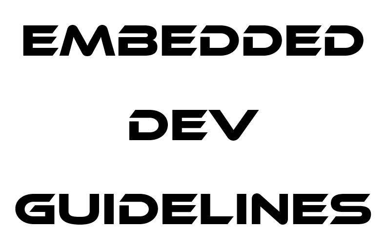

<div>
<p align="center">
<a href="https://www.pinterest.com/pin/357543657939014995/" >
  
</a>
  </p>  
<h1 align="center">
    可触未来嵌入式开发规范
</h1>
<p align="center">
  统一规范 · 精益求精 · 高效协作
</p>
</div>

---


- [0. 版本规范](#0-版本规范)
- [X. 🖋️开发者签名墙](#x-️开发者签名墙)

## 0. 版本规范

为确保嵌入式固件的交付具有良好的可追溯性、可维护性及一致性，考虑了美观性、可读性、可维护性、可扩展性，我们制定如下版本命名规范。

### 0.0. 命名格式

```plaintext
部件-主版本.次版本.补丁_发版日期-硬件版本_硬件小版本-固件生命周期.axf
```

示例：

```plaintext
CLIFF-V1.1.1_250710-HW1.0_250331-beta.axf
```


### 0.1. 各字段定义

| 字段         | 示例                 | 含义                                                                |
| ------------ | -------------------- | ------------------------------------------------------------------- |
| 部件         | `CLIFF`              | 字母全大写，产品或项目代号，用于区分不同模组或固件系列              |
| 主版本       | `V1.`                | 架构级不兼容时更新                                                  |
| 次版本       | `2.`                 | 新增向下兼容功能时递增                                              |
| 补丁         | `3`                  | BUG修复/优化参数时递增                                              |
| 发版日期     | `250710`             | 固件生成或发版日期，格式为 `YYMMDD`（例：250710）                   |
| 硬件主版本   | `HW1.0`              | 支持该固件的硬件主版本号                                            |
| 硬件小版本   | `250331`             | 区分硬件小批次微调或小幅改版的标识，通常用生产/修改日期表示         |
| 固件生命周期 | `alpha`              | alpha：内测，beta：厂测/公测，release：正式发布版 |
| 文件后缀     | `.hex`/`.bin`/`.axf` | 固件编译输出文件格式，通常用于 ARM 链路的可执行映像文件             |


### 0.2. 命名规范的权衡与说明

- **部件**
  部件用于区分不同模组或固件系列，如 `CLIFF` 代表底盘悬崖板，`MOTHER_BOARD` 代表主板

- **软件版本说明**
  软件版本号采用主版本.次版本.补丁规范。

  - 主版本（Major）：表示架构级不兼容的更新。例如：
    - 更换主控MCU（如从ESP32切换到OM6621PW）
    - 更换了完全不同的传感器（如底盘悬崖板由PL2219切换到MTK311）
    - 系统架构由裸机切换为RTOS
    - 电源架构大幅调整导致固件适配方式变化

  - 次版本（Minor）：表示新增向下兼容功能。例如：
    - 新增了标定功能
    - 增加了对新外设（如蜂鸣器、LED灯、按键）的支持
    - 增加了新的通信指令或数据上报格式
    - 增加了OTA升级功能
    - 增加了日志存储功能

  - 补丁（Patch）：表示BUG修复或参数优化。例如：
    - 修复了ADC采集异常的问题
    - 修正了串口波特率设置错误
    - 优化了低功耗模式下的唤醒逻辑
    - 调整了PID参数以提升控制精度


- **为什么要包含硬件版本**
  不同于传统的软件开发，嵌入式开发需要考虑硬件的兼容性，包含硬件版本号可以帮助快速判断该固件的适用场景

- **硬件版本说明**
  硬件版本号通常向硬件工程师索取，定义如下：
  - 硬件主版本号：**用于区分原理图变更**。硬件工程师同样使用`V` 开头，为了与软件版本进行区分，软件版本中的硬件版本使用 `HW` 开头，如 `HW1.0`
  - 硬件小版本号：**用于区分PCB变更**，通常用生产/修改日期表示，如 `250331`
  - 值得注意，对于物料变更，如更换了PCB上某颗电容和电阻的数值，这属于BOM变更，不会反映在硬件版本号上，BOM变更由硬件工程师维护
  - 硬件版本号由主版本号和小版本号组合，如 `HW1.0_250331`

- **日期说明**
  发版日期代表这个固件的发布日期，TODO，在固件有和硬件小版本日期采用 `YYMMDD`，注意单独月份和日期需要补0，错误示范：`25710` ，正确示范：`250710`。这是权衡了简洁与可读性之后的选择

- **生命周期清晰**
  同一个固件通过这个字段来区分不同阶段，如 `alpha` 代表内测，`beta` 代表厂测/公测，`release` 代表正式发布。一个固件完整的生命周期如下：
  - `alpha`阶段：代表刚刚完成开发，还未进行测试的固件，此时固件可能存在一些问题，如功能缺失、性能不佳、稳定性不足等，等待测试工程师进行测试，测试通过后，固件进入`beta`阶段，测试不通过，反馈给嵌入式工程师进行修复，修复后，重新发布一个新版的固件，进入`alpha`阶段，直到测试通过
  - `beta`阶段：代表已经经过测试的固件，此时固件可能存在一些问题，如功能缺失、性能不佳、稳定性不足等，等待测试工程师进行测试，测试通过后，固件给到工厂进行生产测试，测试通过后，固件进入`release`阶段
  - `release`阶段：代表已经完成开发，并经过内部测试、工厂测试的固件，可以进行量产使用
  - 每个阶段固件的命名格式相同，只是生命周期字段以及发版日期不同,如： 
    - `CLIFF-V1.1.1_250710-HW1.0_250331-alpha.axf` 代表内测版本，
    - `CLIFF-V1.1.1_250714-HW1.0_250331-beta.axf` 代表厂测/公测版本，
    - `CLIFF-V1.1.1_250723-HW1.0_250331-release.axf` 代表正式发布版本

- **固件生命周期流程图**

```
固件开发完成，进入alpha阶段
    ↓
alpha阶段/内测版本
    ↓
内部测试工程师测试
    ↓
    ├─ 测试通过 → 进入beta阶段/厂测版本
    │              ↓
    │           工厂生产测试
    │              ↓
    │            ├─ 测试通过 → 进入release阶段/正式发布版本 → 量产使用
    │            └─ 测试不通过 → 反馈问题
    └─ 测试不通过 → 反馈问题
                    ↓
                嵌入式工程师修复
                    ↓
                重新发布新版本
                    ↓
                (回到alpha阶段)
```

---


## X. 🖋️开发者签名墙

在阅读完嵌入式开发规范后，你可以前往 `signatures/` 提交一份轻松的承诺声明。这不是约束，而是一次有温度的约定：

> “我用代码表达对团队、设备、合作和用户的尊重。”

签署方法：
1. 复制模板文件 [`000yourname.md`](./signatures/000yourname.md)
2. 修改文件名称，将 `000yourname` 替换为你的名字，保存为 `signatures/你的名字.md`
3. 修改文件内容，将 `Marilyn Raymond` 替换为你的名字，将 `2025年07月10日` 替换为今天日期
4. 提交 PR / push！

欢迎加上一句你的名言、吐槽或 Debug 哲学，让这个墙更有趣 🙌
